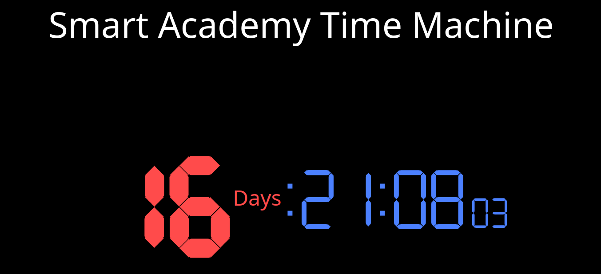

# javascript-contest

This is simple contest for winning free tickets to We Are Developers by the name of `SmartAcademyVienna`!!! Make your coffee and get mind set to win the ticket!!

# Installation

1. Clone the project using:

```bash
$ git clone https://github.com/SmartAcademyVienna/javascript-contest.git
```

2. Install all required dependencies using:

```bash
$ npm install
```

## Requirements

There is a missing functionality in the application "Smart Academy Time Machine" which is responsible to show the time by days,hours,minuets, seconds. The function is missing just few line which are responsible to get the difference time from 6.6.2019 and the current day.

TODO are:

- Get total milliseconds of the time difference (between those dates of 6.6.2019 and the current date).
- Calculate how much days are left.
- Calculate how much hours are left.
- Calculate how much minutes are left.
- Calculate how much seconds are left.

When are calculated then a nice function will be called `setDigit(days + hours + mins + secs);` which is taking all calculated time as string then render it to the HTML.

When it's done then the final result should be like that demo bellow:



HAPPY CODING!!!
